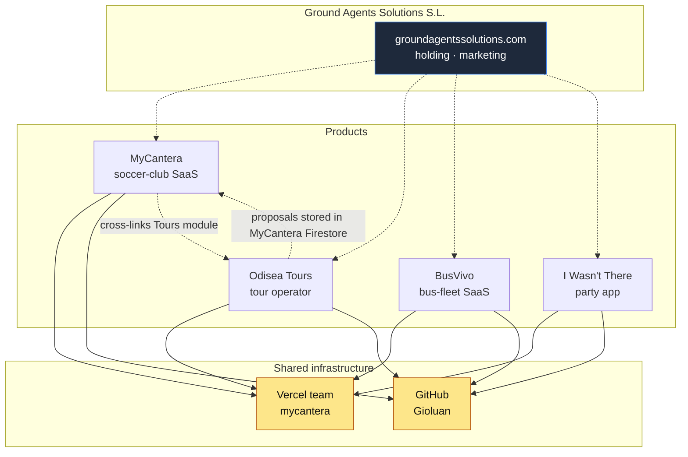

# Ground Agents Solutions — Technical Documentation

> **Confidential.** Shared with prospective acquirers and partners under NDA. Not for public distribution.

This repository describes the four production SaaS products operated by **Ground Agents Solutions S.L.** (Spain, group-travel & sports-tech holding since 2005). It is intended as due-diligence material for buyers, technical co-founders, or partners evaluating any of the products listed below.

Every product is live, hosted, and operated from this codebase. Source code lives in the linked GitHub repositories.

---

## Products in scope

| Product | Domain | Stage | One-liner |
|---|---|---|---|
| **MyCantera** | [mycantera.com](https://mycantera.com) | Live, paid users | Soccer-club management SaaS (squads, matches, training, AI reports). 3-tier pricing. |
| **Odisea Tours** | [odisea-tours.com](https://odisea-tours.com) | Live, revenue-generating | Group sports & cultural travel tour operator. 30+ pages, 5 packaged tours, internal CRM. |
| **BusVivo** | [busvivo.com](https://busvivo.com) | Live, founding-partner pilots | Bus-fleet tracking & compliance SaaS for Spanish autocar SMEs. EU 561 driver-hours engine. |
| **I Wasn't There** | [iwasntthere.com](https://iwasntthere.com) | Live, indexed | Ephemeral bachelor/hen-party photo & chat app. Auto-deletes everything when the trip ends. |

---

## How to navigate this repo

```
README.md                       you are here
ecosystem.md                    how the four products relate (shared infra, cross-links)
due-diligence/
  accounts-inventory.md         every external account that needs to transfer on closing
  monthly-costs.md              recurring costs per product
  third-party-services.md       per-product dependency matrix
  handover-checklist.md         what flips on closing day
products/
  mycantera/                    full per-product docs
  odisea-tours/
  busvivo/
  i-wasnt-there/
static/                         password-gated viewer (deployed under /dd on groundagentssolutions.com)
scripts/                        deploy / sync helpers
```

Each product folder follows the same shape:

- `README.md` — what it is, who pays for it, status, traction
- `stack-and-infra.md` — repo, hosting, domains, env vars, Firebase project, DNS
- `data-model.md` — Firestore / RTDB collections, key schemas
- `operations.md` — deploy, rollback, runbooks, known-good states

---

## Quick relationship map



For the full architecture diagram see [ecosystem.md](ecosystem.md).

---

## Sellable as a bundle, sellable individually

Each product can be carved out and sold independently. MyCantera and Odisea Tours share one read-only cross-link (Odisea proposals live in the MyCantera Firestore for the unified `/sales` CRM); the share can be cleanly cut by exporting the `odisea_proposals` collection and pointing Odisea's proposal builder to its own Firestore. BusVivo and I Wasn't There are fully isolated.

See [`due-diligence/handover-checklist.md`](due-diligence/handover-checklist.md) for the closing-day flip steps.

---

## Operator

Operated solo by the founder (Juan, Spain) with two collaborators (Aitor — Middle-East ops, Raul — sales rep). No engineering team to inherit — the value being sold is the running product, the brand, the data, the customer relationships, and a clean modern codebase.

Direct technical questions: **juan@odisea-tours.com**.

---

_Last updated: 2026-05-13_
