# Ecosystem — how the four products relate

Ground Agents runs four production products that share a small amount of common infrastructure but are otherwise independent. The shared infrastructure is **convenience, not coupling**: any product can be carved out and operated standalone within a day.

---

## Full architecture diagram

```mermaid
flowchart TB
  subgraph PARENT["Ground Agents Solutions S.L. (parent)"]
    GAS["groundagentssolutions.com<br/>Static marketing site<br/>Holding company since 2005"]
  end

  subgraph USERS["End users"]
    direction LR
    U_MC["Club directors / coaches /<br/>parents / players"]
    U_OT["Tour organizers, schools,<br/>youth coaches"]
    U_BV["Bus operators (autocar SMEs)<br/>+ their drivers"]
    U_IWT["Bachelor / hen party groups"]
    U_OPS["Founder + Aitor + Raul<br/>(internal ops)"]
  end

  subgraph MC["mycantera.com — soccer-club SaaS"]
    MC_Next["Next.js 16 on Vercel<br/>PWA · Tailwind v4 · TS"]
    MC_Sales["/sales unified CRM<br/>(MyCantera + Odisea)"]
    MC_News["learn.mycantera.com<br/>Coach AI newsletter"]
    MC_FB["Firebase<br/>mycantera-2beb5"]
    MC_AI["Anthropic Claude API"]
    MC_Stripe["Stripe<br/>Free / $29 / $99"]
    MC_Resend["Resend (newsletter key)"]

    MC_Next --> MC_FB & MC_AI & MC_Stripe
    MC_Sales --> MC_FB
    MC_News --> MC_Resend
  end

  subgraph OT["odisea-tours.com — tour operator"]
    OT_Next["Next.js 16 on Vercel<br/>30+ pages · blog · RSS"]
    OT_CRM["Odisea CRM (vanilla JS)<br/>repo: Gioluan/OdiseaTours"]
    OT_FB["Firebase (own project)"]
    OT_GA["GA4 G-902SEZT8Z1"]
    OT_DNS["DNS on Cloudflare<br/>MX → Hostalia"]
    OT_Resend["Resend sender<br/>juan@odisea-tours.com"]

    OT_Next --> OT_GA
    OT_CRM --> OT_FB
    OT_DNS --> OT_Next
  end

  subgraph BV["busvivo.com — bus-fleet SaaS"]
    BV_Next["Next.js 16 on Vercel<br/>PWA · Tailwind v4 · TS"]
    BV_FB["Firebase<br/>busvivo-1b259<br/>Firestore + RTDB"]
    BV_WA["WhatsApp pairing links<br/>(no SMS infra)"]

    BV_Next --> BV_FB
    BV_Next --> BV_WA
  end

  subgraph IWT["iwasntthere.com — ephemeral party app"]
    IWT_Next["Next.js 16 on Vercel<br/>PWA · Tailwind v4"]
    IWT_FB["Firebase (own project)<br/>Auth + FS + Storage"]
    IWT_Stripe["Stripe<br/>Party Mode<br/>£7.99 / €8.99 / $9.99"]
    IWT_Mail["Cloudflare email routing<br/>partnerships@iwasntthere.com"]

    IWT_Next --> IWT_FB & IWT_Stripe
    IWT_Mail --> IWT_Next
  end

  GAS -. "showcases" .-> MC & OT & BV & IWT

  U_MC --> MC_Next
  U_OT --> OT_Next
  U_BV --> BV_Next
  U_IWT --> IWT_Next
  U_OPS --> OT_CRM
  U_OPS --> MC_Sales

  MC_Next -. "Tours module CTA" .-> OT_Next
  OT_Next -. "proposals stored in" .-> MC_FB
  OT_Resend -. "send-email API" .-> MC_Sales

  classDef parent fill:#1e293b,stroke:#3b82f6,color:#fff,stroke-width:2px
  classDef shared fill:#fde68a,stroke:#b45309,color:#111
  classDef external fill:#dbeafe,stroke:#1d4ed8,color:#111
  class GAS parent
  class MC_Sales,MC_FB shared
  class MC_AI,MC_Stripe,MC_Resend,IWT_Stripe,OT_Resend,OT_GA,OT_DNS,IWT_Mail,BV_WA external
```

---

## What's actually shared

### 1. Vercel team
All four product Next.js apps deploy under the same Vercel team (`mycantera`). One billing relationship, one set of secrets, one auto-deploy pipeline from `master` on each repo.

**Carve-out:** Vercel projects can be transferred to a new team in minutes via Vercel's UI. No code change.

### 2. GitHub organization
All four product repos sit under the `Gioluan` GitHub account. Repos can be transferred to a new owner with no code change; CI, Vercel deploy hooks, and secrets re-bind on first push.

### 3. MyCantera / Odisea cross-link
The unified CRM at `mycantera.com/sales` is used internally to run sales for **both** MyCantera and Odisea Tours. It writes to the MyCantera Firestore in two segregated collections:

- `sales_prospects` — MyCantera leads
- `odisea_proposals` — Odisea proposals (published at `odisea-tours.com/for/[slug]`)

**Carve-out:** Export `odisea_proposals` to JSON, import to Odisea's own Firebase project, point Odisea's proposal pages at the new path. ~half-day of work. Detailed steps in [due-diligence/handover-checklist.md](due-diligence/handover-checklist.md).

### 4. Resend
MyCantera and Odisea Tours both send transactional email via Resend. Odisea uses its own verified sender `juan@odisea-tours.com`. MyCantera's newsletter uses a separate Resend key on `learn.mycantera.com`. No domain dependency between the two.

---

## What's NOT shared

- **BusVivo** has its own Firebase project (`busvivo-1b259`), its own domain, its own auth, its own data. Zero cross-dependency with the other three.
- **I Wasn't There** has its own Firebase project, its own Stripe account, its own DNS (Cloudflare email routing to Gmail). Zero cross-dependency with the other three.
- **Each product has its own domain and DNS.** No wildcard, no shared subdomain.
- **No shared user database, no shared auth, no shared session layer.** Users authenticate per-product.

---

## Carve-out scenarios

| Scenario | Effort | Notes |
|---|---|---|
| Sell MyCantera alone | Half-day | Migrate `odisea_proposals` collection out, point Odisea CRM at its own Firebase. |
| Sell Odisea alone | Half-day | Same as above, plus transfer Odisea CRM repo. |
| Sell BusVivo alone | < 1 hour | Transfer repo + Vercel project + Firebase project + domain. Self-contained. |
| Sell I Wasn't There alone | < 1 hour | Same as BusVivo. Self-contained. |
| Sell the whole bundle | Day | Transfer Vercel team, GitHub org-by-org, all Firebase projects, all domains. Single bill-of-sale. |

See [due-diligence/handover-checklist.md](due-diligence/handover-checklist.md) for the closing-day flip-by-flip checklist.
